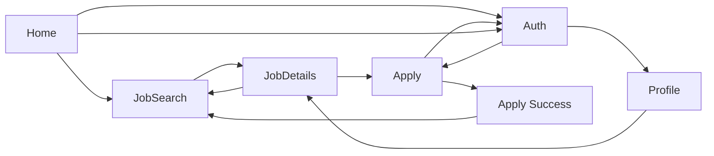

# Public UI Wireframes

This document describes the **low-fidelity wireframes** and **high-fidelity prototype** structure for the Job Portal public-facing experience. Wireframes are specified for a **1440px desktop** artboard; responsive behavior is defined for **mobile (320–767px)**, **tablet (768–1023px)**, and **desktop (1024px+)**.

> **Delivery note:** Figma was skipped per story instructions. Low-fidelity structure lives in this document; the **high-fidelity interactive prototype** is the React app in `job-portal-frontend/` (run with `npm run dev`). Optional Figma links can be added later if the design team publishes files.

| Deliverable | Owner | Status | Link |
|-------------|--------|--------|------|
| Low-fidelity wireframes | Design / Eng | Documented here | This README (ASCII frames + flows) |
| High-fidelity prototype | Eng | Implemented | `job-portal-frontend/` — share Vite preview URL |
| Design hand-off | Eng | Ready | [DESIGN-HANDOFF.md](./DESIGN-HANDOFF.md) |
| Figma (optional) | Design | Pending | `https://www.figma.com/file/PLACEHOLDER-public-ui-wireframes` |

---

## Design principles

- **WCAG 2.1 Level AA**: color contrast ≥ 4.5:1 for normal text, ≥ 3:1 for large text and UI components; visible focus indicators; labels for all form controls; keyboard-operable navigation and modals.
- **Responsive**: single-column stack on mobile; filters and sidebars collapse or move to drawers on smaller viewports.
- **Consistent chrome**: global **header** (logo, primary nav, auth CTAs) and **footer** (legal, support, social) on every public page unless noted.

---

## Global layout (all pages)

```
┌──────────────────────────────────────────────────────────────┐
│ HEADER: Logo | Home | Find Jobs | [Search icon] | Login | Sign Up │
├──────────────────────────────────────────────────────────────┤
│                                                              │
│                     MAIN CONTENT AREA                        │
│                                                              │
├──────────────────────────────────────────────────────────────┤
│ FOOTER: About | Privacy | Terms | Contact | © Year           │
└──────────────────────────────────────────────────────────────┘
```

| Zone | Purpose | Wireframe treatment |
|------|---------|---------------------|
| Header | Brand, primary navigation, authentication entry | Gray bar; logo left; nav center/right; button placeholders |
| Main | Page-specific content | White/light area; labeled blocks only |
| Footer | Secondary links and legal | Dark gray bar; link placeholders |

**Header – logged out:** Logo → Home; **Find Jobs** → Job Search; **Login** → Registration/Login (login tab); **Sign Up** → Registration/Login (register tab).  
**Header – logged in:** Replace auth buttons with **Profile** avatar/menu → User Profile; optional **My Applications** (future).

---

## Page wireframes

### 1. Home

**Route:** `/`  
**Goal:** Orient visitors, surface search, highlight featured jobs and value proposition.

```
┌──────────────────────────────────────────────────────────────┐
│ [Header]                                                     │
├──────────────────────────────────────────────────────────────┤
│  HERO                                                        │
│  [Headline placeholder]                                      │
│  [Subcopy placeholder]                                       │
│  ┌─────────────────────────────────────┐  [ Search Jobs CTA ] │
│  │ Keyword search input                │                     │
│  └─────────────────────────────────────┘                     │
├──────────────────────────────────────────────────────────────┤
│  FEATURED JOBS (card grid, 3 columns desktop)                │
│  [ Card ] [ Card ] [ Card ]                                  │
│  [ View all jobs → ]                                         │
├──────────────────────────────────────────────────────────────┤
│  HOW IT WORKS (3 steps – icons + short text)                 │
│  [ Step 1 ] [ Step 2 ] [ Step 3 ]                            │
├──────────────────────────────────────────────────────────────┤
│  [Footer]                                                    │
└──────────────────────────────────────────────────────────────┘
```

| Element | Placement | Notes |
|---------|-----------|--------|
| Hero search | Above fold, centered | Submit navigates to Job Search with query prefilled |
| Featured job cards | Below hero | Title, company, location, employment type; card click → Job Details |
| CTA “View all jobs” | Below grid | → Job Search |

**Prototype links:** Search / CTA → Job Search; job card → Job Details; Login / Sign Up → Registration/Login.

---

### 2. Job Search

**Route:** `/jobs`  
**Goal:** Browse and filter listings; open a job for details.

```
┌──────────────────────────────────────────────────────────────┐
│ [Header]                                                     │
├──────────────┬───────────────────────────────────────────────┤
│ FILTERS      │  RESULTS HEADER                               │
│ (sidebar)    │  [“N jobs found”] [Sort dropdown ▼]         │
│              ├───────────────────────────────────────────────┤
│ Keyword      │  [ Job result row / card ]                    │
│ Location     │  [ Job result row / card ]                    │
│ Category     │  [ Job result row / card ]                    │
│ Job type     │  ...                                          │
│ Salary range │  [ Pagination ]                             │
│ [ Apply      │                                               │
│   filters ]  │                                               │
├──────────────┴───────────────────────────────────────────────┤
│ [Footer]                                                     │
└──────────────────────────────────────────────────────────────┘
```

**Mobile:** Filters behind **“Filters”** button → full-screen or bottom sheet drawer.

| Element | Placement | Notes |
|---------|-----------|--------|
| Filter sidebar | Left 280–320px desktop | Collapsible sections; apply updates results |
| Result list | Right / full width mobile | Each row: title, company, location, posted date, snippet |
| Sort | Top of results | Newest, relevance, salary (if available) |
| Pagination | Bottom of list | Accessible numbered controls |

**Prototype links:** Result row → Job Details; header nav unchanged.

---

### 3. Job Details

**Route:** `/jobs/:id`  
**Goal:** Present full job information and drive apply or save actions.

```
┌──────────────────────────────────────────────────────────────┐
│ [Header]                                                     │
├──────────────────────────────────────────────────────────────┤
│  Breadcrumb: Home > Jobs > [Job Title]                       │
│  ┌────────────────────────────┐  ┌─────────────────────────┐ │
│  │ Job title (H1)             │  │ STICKY ACTIONS (desktop)│ │
│  │ Company · Location · Type  │  │ [ Apply Now ]           │ │
│  │ Posted date · Job ID       │  │ [ Save job ] (optional) │ │
│  └────────────────────────────┘  └─────────────────────────┘ │
│  DESCRIPTION (sections)                                      │
│  [ Overview ] [ Responsibilities ] [ Requirements ] [ Benefits]│
│  APPLY BAR (mobile fixed bottom)                             │
│  [ Apply Now ]                                               │
├──────────────────────────────────────────────────────────────┤
│  RELATED JOBS (optional, 2–3 cards)                          │
├──────────────────────────────────────────────────────────────┤
│ [Footer]                                                     │
└──────────────────────────────────────────────────────────────┘
```

| Element | Placement | Notes |
|---------|-----------|--------|
| Primary CTA **Apply Now** | Sticky sidebar desktop; fixed bottom bar mobile | → Apply (auth gate if not logged in) |
| Content sections | Single column | Scannable headings; plain language |
| Breadcrumb | Top | Back to Job Search |

**Prototype links:** Apply Now → Apply (or Registration/Login with return URL); breadcrumb → Job Search.

---

### 4. Apply

**Route:** `/jobs/:id/apply`  
**Goal:** Collect application materials and confirm submission.

```
┌──────────────────────────────────────────────────────────────┐
│ [Header]                                                     │
├──────────────────────────────────────────────────────────────┤
│  H1: Apply for [Job Title]                                   │
│  [Job summary strip: company, location]                      │
│  ┌────────────────────────────────────────────────────────┐  │
│  │ FORM                                                   │  │
│  │ Full name*                                             │  │
│  │ Email*                                                 │  │
│  │ Phone                                                  │  │
│  │ Resume upload* [ Choose file ]                         │  │
│  │ Cover letter (textarea)                                │  │
│  │ [ ] I agree to privacy policy*                         │  │
│  │ [ Submit application ]  [ Cancel → Job Details ]       │  │
│  └────────────────────────────────────────────────────────┘  │
│  SUCCESS STATE (separate frame): confirmation + link to jobs │
├──────────────────────────────────────────────────────────────┤
│ [Footer]                                                     │
└──────────────────────────────────────────────────────────────┘
```

| Element | Placement | Notes |
|---------|-----------|--------|
| Required fields | Marked with `*` and `aria-required` | Inline validation on blur/submit |
| Resume upload | File input + drag-drop zone (hifi) | Accepted types: PDF, DOCX; max size TBD by API |
| Cancel | Secondary | Returns to Job Details |

**Auth:** If user is not logged in, redirect to Registration/Login with `?returnUrl=/jobs/:id/apply`.

**Prototype links:** Submit → success confirmation; Cancel → Job Details.

---

### 5. Registration / Login

**Route:** `/auth` (or `/login`, `/register` with shared layout)  
**Goal:** Authenticate or create an account; support password recovery entry point.

```
┌──────────────────────────────────────────────────────────────┐
│ [Header – minimal: logo only or full header]               │
├──────────────────────────────────────────────────────────────┤
│              ┌─────────────────────────────┐                 │
│              │ [ Login | Register ] tabs   │                 │
│              │                             │                 │
│              │  Email*                     │                 │
│              │  Password*                  │                 │
│              │  [ ] Remember me            │                 │
│              │  [ Primary submit ]         │                 │
│              │  Forgot password?           │                 │
│              │  --- or ---                 │                 │
│              │  (Register tab)             │                 │
│              │  Name*, Email*, Password*,  │                 │
│              │  Confirm password*          │                 │
│              │  [ ] Terms acceptance*      │                 │
│              └─────────────────────────────┘                 │
├──────────────────────────────────────────────────────────────┤
│ [Footer]                                                     │
└──────────────────────────────────────────────────────────────┘
```

| Element | Placement | Notes |
|---------|-----------|--------|
| Tab control | Top of card | Login vs Register; preserve `returnUrl` |
| Card width | ~400–480px centered | Full width minus padding on mobile |
| Error summary | Top of form on failed auth | `role="alert"` |

**Prototype links:** Successful login/register → `returnUrl` or User Profile / Home.

---

### 6. User Profile

**Route:** `/profile` (authenticated)  
**Goal:** View and edit candidate profile and application history entry point.

```
┌──────────────────────────────────────────────────────────────┐
│ [Header – logged in]                                         │
├──────────────────────────────────────────────────────────────┤
│  H1: My Profile                                              │
│  ┌──────────────┬───────────────────────────────────────────┐  │
│  │ SIDE NAV     │  CONTENT PANEL                          │  │
│  │ · Personal   │  [ Avatar / initials ]                  │  │
│  │ · Resume     │  Personal info form                     │  │
│  │ · Applications│  Name, email, phone, location          │  │
│  │ · Security   │  [ Save changes ]                       │  │
│  │ · Log out    │                                         │  │
│  └──────────────┴───────────────────────────────────────────┘  │
├──────────────────────────────────────────────────────────────┤
│ [Footer]                                                     │
└──────────────────────────────────────────────────────────────┘
```

**Mobile:** Side nav becomes horizontal tabs or select menu.

| Section | Content |
|---------|---------|
| Personal | Editable fields; save with toast confirmation |
| Resume | Upload/replace resume used for quick apply |
| Applications | Table/list of applied jobs with status (links to Job Details) |
| Security | Change password; optional 2FA later |

**Prototype links:** Log out → Home (logged out); application row → Job Details.

---

## Navigation flow (prototype connections)

Frames in Figma should be linked to match this flow (approved with Business Analyst):



| From | Action | To |
|------|--------|-----|
| Home | Hero search / View all jobs | Job Search |
| Home | Featured job card | Job Details |
| Home | Login / Sign Up | Registration/Login |
| Job Search | Result click | Job Details |
| Job Details | Apply Now | Apply (or Auth if guest) |
| Apply | Submit | Apply success |
| Apply | Cancel | Job Details |
| Auth | Success with returnUrl | Apply or prior page |
| Auth | Success (no return) | User Profile or Home |
| Header | Profile (logged in) | User Profile |

---

## High-fidelity prototype (summary)

Duplicate each wireframe frame into the high-fidelity file and apply:

| Layer | Specification |
|-------|----------------|
| Color & type | See [DESIGN-HANDOFF.md](./DESIGN-HANDOFF.md) – brand tokens |
| Components | Buttons, inputs, cards, tags, dropdowns with hover/focus/disabled |
| Interactions | Filter drawer (mobile), sort dropdown, tab switch on Auth, Apply sticky CTA |
| Auto Layout | Figma auto-layout on stacks; constraints for resize at 375 / 768 / 1440 |
| Prototype | Hotspots per navigation table above; overlay for mobile filter drawer |

Publish the prototype and add the shareable link to the table at the top of this document.

---

## Responsive breakpoints

| Breakpoint | Width | Layout changes |
|------------|-------|----------------|
| Mobile | 320–767px | Single column; hamburger nav; filter drawer; fixed Apply bar on Job Details |
| Tablet | 768–1023px | 2-column job grid where applicable; condensed filter panel |
| Desktop | 1024–1440+ | Full sidebar filters; 3-column featured grid; sticky apply sidebar |

Wireframe artboards use **1440px** width; additional frames at **375px** and **768px** are recommended in Figma for QA.

---

## Business Analyst review checklist

- [ ] All six pages represented with header/footer placeholders  
- [ ] Navigation paths match table and diagram above  
- [ ] Guest vs authenticated header states documented  
- [ ] Apply flow includes auth redirect and success state  
- [ ] Mobile filter and sticky Apply called out  
- [ ] WCAG contrast and focus states planned in high-fidelity file  

---

## Related documentation

- [Design hand-off for developers](./DESIGN-HANDOFF.md) – tokens, components, accessibility, and implementation notes  
- [Project overview](../../README.md)
