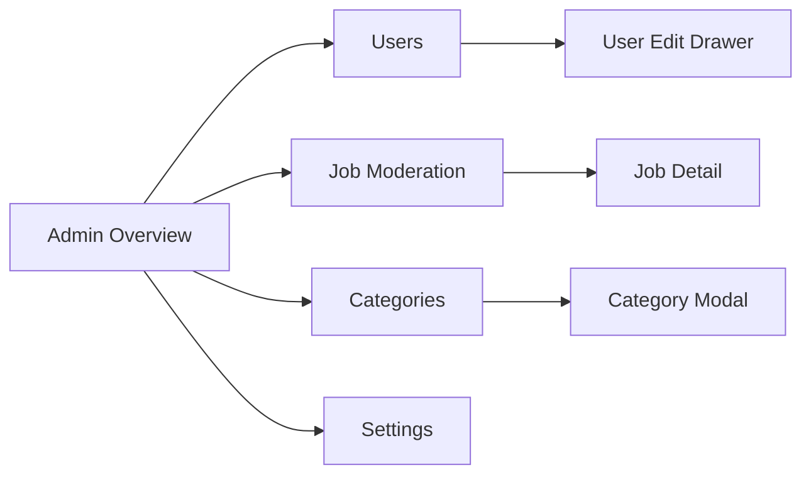
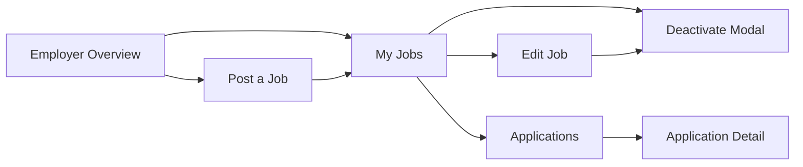

# Admin & Employer Dashboard Wireframes

This document specifies **high-fidelity wireframe structure** for the Job Portal **Admin** and **Employer** dashboards. Frames are designed for a **1440px desktop** artboard with responsive notes for **tablet (768–1023px)** and **mobile (320–767px)**. Both dashboards share a common **dashboard shell** (sidebar navigation, top bar, content area) aligned with the public UI design language.

> **Figma deliverables (pending — design team)**  
> Wireframes and linked prototypes must be created in Figma before stakeholder sign-off and implementation. Replace placeholder URLs below once files are shared with the Business Analyst and development team.

| Deliverable | Owner | Status | Link |
|-------------|--------|--------|------|
| Admin Dashboard Wireframes | Design | Pending | `https://www.figma.com/file/PLACEHOLDER-admin-dashboard-wireframes` |
| Employer Dashboard Wireframes | Design | Pending | `https://www.figma.com/file/PLACEHOLDER-employer-dashboard-wireframes` |
| Combined dashboard prototype | Design | Pending | `https://www.figma.com/proto/PLACEHOLDER-dashboard-prototype` |

**Story:** Create Wireframes for Admin and Employer Dashboards  
**Epic:** Admin & Employer Dashboard Development  
**Companion doc:** [Dashboard Design Hand-off](./DASHBOARD-DESIGN-HANDOFF.md)

---

## Shared dashboard shell

Both admin and employer experiences use the same layout pattern for visual consistency.

```
┌──────────┬───────────────────────────────────────────────────────────┐
│          │ TOP BAR: Breadcrumb | [Search optional] | User menu ▼     │
│ SIDEBAR  ├───────────────────────────────────────────────────────────┤
│          │                                                           │
│ [Logo]   │  PAGE HEADER: H1 title + primary action button(s)        │
│          │  ─────────────────────────────────────────────────────────  │
│ Nav      │                                                           │
│ items    │  MAIN CONTENT (tables, forms, charts, detail panels)      │
│          │                                                           │
│          │                                                           │
│ ───────  │                                                           │
│ Log out  │                                                           │
└──────────┴───────────────────────────────────────────────────────────┘
```

| Zone | Width (desktop) | Purpose |
|------|-----------------|---------|
| Sidebar | 240–260px fixed | Primary navigation; collapses to icon rail or drawer on tablet/mobile |
| Top bar | Full remaining width | Context breadcrumb, optional global search, notifications (admin), user avatar menu |
| Content | Fluid, max ~1200px inner | Page-specific tables, forms, widgets |

**Design tokens:** Reuse tokens from the public UI hand-off (`--color-primary`, `--font-family`, spacing scale). Dashboard surfaces use `--color-surface` for sidebar and `--color-background` for content.

**Role-based access:** Admin routes require `admin` role; employer routes require `employer` role. Unauthorized users see a 403 page (not wireframed here; reuse public error pattern).

---

## Admin Dashboard

**Base route:** `/admin`  
**Audience:** Platform administrators

### Sidebar navigation

| Nav item | Route | Icon placeholder |
|----------|-------|------------------|
| Overview | `/admin` | Dashboard |
| Users | `/admin/users` | Users |
| Jobs | `/admin/jobs` | Briefcase |
| Categories | `/admin/categories` | Tags |
| Settings | `/admin/settings` | Gear |
| *(divider)* | — | — |
| View public site | `/` | External link |
| Log out | — | Sign out |

**Interaction labels (Figma):** Each nav item → corresponding frame; active state = left border accent + bold label.

---

### 1. Admin Overview (Analytics)

**Route:** `/admin`  
**Goal:** At-a-glance platform health and moderation queue summary.

```
┌──────────┬───────────────────────────────────────────────────────────┐
│ [Sidebar]│ TOP BAR                                                   │
│          ├───────────────────────────────────────────────────────────┤
│          │  H1: Dashboard overview                                   │
│          │  ┌─────────┐ ┌─────────┐ ┌─────────┐ ┌─────────┐          │
│          │  │ KPI:    │ │ KPI:    │ │ KPI:    │ │ KPI:    │          │
│          │  │ Total   │ │ Active  │ │ Pending │ │ New     │          │
│          │  │ users   │ │ jobs    │ │ jobs    │ │ apps    │          │
│          │  │ [chart] │ │ [chart] │ │ [chart] │ │ [chart] │          │
│          │  └─────────┘ └─────────┘ └─────────┘ └─────────┘          │
│          │  ┌──────────────────────────┐ ┌────────────────────────┐ │
│          │  │ CHART: Applications      │ │ CHART: Jobs by status    │ │
│          │  │ over time (line/bar)     │ │ (donut or bar)           │ │
│          │  │ [placeholder chart area] │ │ [placeholder chart area] │ │
│          │  └──────────────────────────┘ └────────────────────────┘ │
│          │  ┌──────────────────────────────────────────────────────┐ │
│          │  │ TABLE: Recent activity (moderation queue preview)      │ │
│          │  │ Type | Subject | Submitted | [ Review → ]            │ │
│          │  └──────────────────────────────────────────────────────┘ │
└──────────┴───────────────────────────────────────────────────────────┘
```

| Widget | Data / placeholder | Interaction label |
|--------|-------------------|-------------------|
| KPI cards (×4) | Total users, active jobs, pending moderation, new applications (7d) | Click card → filtered list view |
| Applications chart | Time-series placeholder | Tooltip on hover (hifi) |
| Jobs by status chart | DRAFT / PUBLISHED / CLOSED / ARCHIVED | Legend toggle (hifi) |
| Recent activity table | Last 10 moderation items | **Review** → Job Moderation detail or Users detail |

---

### 2. User Management

**Route:** `/admin/users`  
**Goal:** Search, view, edit roles, and deactivate user accounts.

```
┌──────────┬───────────────────────────────────────────────────────────┐
│ [Sidebar]│  H1: Users                    [ + Invite user ] (optional) │
│          │  ┌────────────────────────────────────────────────────────┐│
│          │  │ FILTERS: [Search email/name] [Role ▼] [Status ▼] [Apply]││
│          │  └────────────────────────────────────────────────────────┘│
│          │  ┌────────────────────────────────────────────────────────┐│
│          │  │ TABLE                                                  ││
│          │  │ Name | Email | Roles | Status | Joined | Actions     ││
│          │  │ ...  | ...   | ...   | Active | ...    | [Edit][···]││
│          │  │ [ Pagination ]                                         ││
│          │  └────────────────────────────────────────────────────────┘│
└──────────┴───────────────────────────────────────────────────────────┘
```

**User edit drawer / modal** (label: **Edit user**):

| Field | Control | Notes |
|-------|---------|-------|
| First name, Last name | Text inputs | Required |
| Email | Text input | Read-only or editable per policy |
| Roles | Multi-select checkboxes | `admin`, `employer`, `candidate` |
| Status | Toggle or select | Active / Suspended |
| Actions | **Save**, **Cancel**, **Deactivate account** (destructive) |

**Interaction labels:** Row **Edit** → drawer; **···** menu → Deactivate, Reset password (future); **+ Invite user** → invite form modal (optional MVP).

---

### 3. Job Moderation

**Route:** `/admin/jobs`  
**Goal:** Review employer postings, approve, reject, or flag content.

```
┌──────────┬───────────────────────────────────────────────────────────┐
│ [Sidebar]│  H1: Job moderation                                       │
│          │  TABS: [ All ] [ Pending review ] [ Published ] [ Closed ] │
│          │  ┌────────────────────────────────────────────────────────┐│
│          │  │ FILTERS: [Search title] [Employer ▼] [Category ▼]    ││
│          │  └────────────────────────────────────────────────────────┘│
│          │  ┌────────────────────────────────────────────────────────┐│
│          │  │ TABLE                                                  ││
│          │  │ Title | Employer | Status | Posted | [ Review ]      ││
│          │  └────────────────────────────────────────────────────────┘│
└──────────┴───────────────────────────────────────────────────────────┘
```

**Job moderation detail** (split panel or full page, route `/admin/jobs/:id`):

```
┌──────────────────────────────────────────────────────────────────────┐
│  Breadcrumb: Jobs > [Job title]                                      │
│  ┌─────────────────────────────┐  ┌────────────────────────────────┐ │
│  │ JOB PREVIEW                 │  │ MODERATION ACTIONS             │ │
│  │ Title, employer, location   │  │ Status badge                   │ │
│  │ Description (scroll)        │  │ [ Approve & publish ]          │ │
│  │ Salary range                │  │ [ Request changes ]            │ │
│  │                             │  │ [ Reject ]                     │ │
│  │                             │  │ Internal notes (textarea)      │ │
│  │                             │  │ [ Save notes ]                 │ │
│  └─────────────────────────────┘  └────────────────────────────────┘ │
└──────────────────────────────────────────────────────────────────────┘
```

**Interaction labels:** **Review** → detail; **Approve & publish** → confirmation modal → success toast; **Reject** → reason modal (required).

---

### 4. Category Management

**Route:** `/admin/categories`  
**Goal:** CRUD job categories used in search filters and job forms.

```
┌──────────┬───────────────────────────────────────────────────────────┐
│ [Sidebar]│  H1: Categories                      [ + Add category ]   │
│          │  ┌────────────────────────────────────────────────────────┐│
│          │  │ TABLE (sortable)                                       ││
│          │  │ Name | Slug | Job count | Status | [ Edit ] [ Delete ] ││
│          │  └────────────────────────────────────────────────────────┘│
└──────────┴───────────────────────────────────────────────────────────┘
```

**Add / Edit category modal** (label: **Category form**):

| Field | Control |
|-------|---------|
| Name | Text input* |
| Slug | Text input* (auto-generated from name) |
| Description | Textarea |
| Active | Toggle |
| Actions | **Save**, **Cancel** |

**Delete confirmation:** Modal with warning if `job count > 0`; **Delete** / **Cancel**.

---

### 5. Site Settings

**Route:** `/admin/settings`  
**Goal:** Configure global portal options.

```
┌──────────┬───────────────────────────────────────────────────────────┐
│ [Sidebar]│  H1: Site settings                                        │
│          │  SECTION TABS: [ General ] [ Email ] [ Legal ] [ Features ]│
│          │  ┌────────────────────────────────────────────────────────┐│
│          │  │ FORM (General tab example)                             ││
│          │  │ Site name*                                             ││
│          │  │ Support email*                                         ││
│          │  │ Default locale [ ▼ ]                                   ││
│          │  │ Maintenance mode [ toggle ]                            ││
│          │  │ Featured jobs count [ number ]                         ││
│          │  │ [ Save changes ]                                       ││
│          │  └────────────────────────────────────────────────────────┘│
└──────────┴───────────────────────────────────────────────────────────┘
```

| Tab | Fields (placeholders) |
|-----|----------------------|
| General | Site name, support email, locale, maintenance mode |
| Email | SMTP / template placeholders (MVP: notification toggles) |
| Legal | Privacy policy URL, terms URL, cookie banner toggle |
| Features | Enable registrations, require email verification, etc. |

**Interaction label:** **Save changes** → loading state → success toast; unsaved changes prompt on navigate away.

---

## Employer Dashboard

**Base route:** `/employer`  
**Audience:** Employers managing job postings and applications

### Sidebar navigation

| Nav item | Route | Icon placeholder |
|----------|-------|------------------|
| Overview | `/employer` | Dashboard |
| My jobs | `/employer/jobs` | Briefcase |
| Post a job | `/employer/jobs/new` | Plus |
| Applications | `/employer/applications` | Inbox |
| *(divider)* | — | — |
| View public site | `/` | External link |
| Log out | — | Sign out |

**Consistency note:** Sidebar width, typography, and button styles match the admin dashboard; only nav items and accent context differ (employer badge in top bar optional).

---

### 1. Employer Overview

**Route:** `/employer`  
**Goal:** Summary of active jobs and applications needing attention.

```
┌──────────┬───────────────────────────────────────────────────────────┐
│ [Sidebar]│  H1: Welcome, [Employer name]                             │
│          │  ┌─────────┐ ┌─────────┐ ┌─────────┐                       │
│          │  │ Active  │ │ Total   │ │ New     │                       │
│          │  │ jobs    │ │ apps    │ │ apps    │                       │
│          │  └─────────┘ └─────────┘ └─────────┘                       │
│          │  [ Post a job ] (primary CTA)                             │
│          │  ┌────────────────────────────────────────────────────────┐│
│          │  │ TABLE: Jobs needing attention (drafts, low apps)       ││
│          │  │ Title | Status | Applications | [ Manage ]             ││
│          │  └────────────────────────────────────────────────────────┘│
└──────────┴───────────────────────────────────────────────────────────┘
```

**Interaction labels:** **Post a job** → Job creation form; **Manage** → Job edit or applications filtered by job.

---

### 2. Job List

**Route:** `/employer/jobs`  
**Goal:** View all postings with status and quick actions.

```
┌──────────┬───────────────────────────────────────────────────────────┐
│ [Sidebar]│  H1: My jobs                         [ + Post a job ]     │
│          │  FILTERS: [Search] [Status ▼] [Sort ▼]                    │
│          │  ┌────────────────────────────────────────────────────────┐│
│          │  │ TABLE                                                  ││
│          │  │ Title | Location | Status | Posted | Apps | Actions  ││
│          │  │ ...   | ...      | PUBLISHED | ... | 12 | [Edit][···]││
│          │  └────────────────────────────────────────────────────────┘│
└──────────┴───────────────────────────────────────────────────────────┘
```

**Row actions menu (···):**

| Action | Label | Result |
|--------|-------|--------|
| Edit | **Edit job** | → Job edit form |
| View applications | **View applications** | → Applications list filtered by job |
| Deactivate | **Deactivate job** | → Deactivation confirmation modal |
| Duplicate | **Duplicate** (optional) | → New job form prefilled |

**Status badges:** `DRAFT`, `PUBLISHED`, `CLOSED`, `ARCHIVED` — color + text (not color alone).

---

### 3. Job Creation Form

**Route:** `/employer/jobs/new`  
**Goal:** Create a new job posting (draft or publish).

```
┌──────────┬───────────────────────────────────────────────────────────┐
│ [Sidebar]│  H1: Post a job                                           │
│          │  Breadcrumb: My jobs > New job                            │
│          │  ┌────────────────────────────────────────────────────────┐│
│          │  │ FORM                                                   ││
│          │  │ Job title*                                             ││
│          │  │ Category* [ ▼ ]                                        ││
│          │  │ Location                                               ││
│          │  │ Employment type [ ▼ ]                                  ││
│          │  │ Salary min | Salary max | Currency [ ▼ ]             ││
│          │  │ Description* (rich text placeholder)                   ││
│          │  │ ─────────────────────────────────────────────────────  ││
│          │  │ [ Save as draft ]  [ Publish job ]  [ Cancel ]         ││
│          │  └────────────────────────────────────────────────────────┘│
└──────────┴───────────────────────────────────────────────────────────┘
```

**Interaction labels:**

| Control | Label | Behavior |
|---------|-------|----------|
| Save as draft | **Save draft** | `DRAFT` status; toast; stay or → job list |
| Publish job | **Publish** | Validation; `PUBLISHED` or pending moderation per policy |
| Cancel | **Cancel** | Confirm if dirty → job list |

---

### 4. Job Edit Form

**Route:** `/employer/jobs/:id/edit`  
**Goal:** Update an existing posting.

Same layout as **Job Creation Form** with:

- H1: **Edit job**
- Breadcrumb: My jobs > [Job title] > Edit
- Pre-filled fields
- Additional actions: **Deactivate job** (secondary/destructive), **View live listing** (if published)

**Interaction labels:** **Save changes** → toast; **Deactivate** → deactivation flow (below).

---

### 5. Job Deactivation

Triggered from job list **···** menu or edit form.

**Confirmation modal** (label: **Deactivate job**):

```
┌─────────────────────────────────────────┐
│  Deactivate "[Job title]"?              │
│  The listing will be removed from       │
│  public search. Existing applications   │
│  remain accessible.                     │
│  Reason (optional) [ textarea ]         │
│  [ Cancel ]  [ Deactivate ] (destructive)│
└─────────────────────────────────────────┘
```

**Success state:** Toast “Job deactivated”; table row status → `CLOSED` or `ARCHIVED`.

---

### 6. Application Review

**Route:** `/employer/applications` (list) and `/employer/applications/:id` (detail)

**Applications list:**

```
┌──────────┬───────────────────────────────────────────────────────────┐
│ [Sidebar]│  H1: Applications                                         │
│          │  FILTERS: [Job ▼] [Status ▼] [Date range] [Search name]   │
│          │  ┌────────────────────────────────────────────────────────┐│
│          │  │ TABLE                                                  ││
│          │  │ Applicant | Job | Status | Applied | [ Review ]        ││
│          │  └────────────────────────────────────────────────────────┘│
└──────────┴───────────────────────────────────────────────────────────┘
```

**Application detail** (label: **Application detail**):

```
┌──────────┬───────────────────────────────────────────────────────────┐
│ [Sidebar]│  Breadcrumb: Applications > [Applicant name]              │
│          │  ┌─────────────────────────────┐  ┌──────────────────────┐ │
│          │  │ APPLICANT INFO              │  │ STATUS & ACTIONS     │ │
│          │  │ Name, email                 │  │ Current: SUBMITTED   │ │
│          │  │ Applied: [date]             │  │ Status [ ▼ ]         │ │
│          │  │ Job: [title] (link)         │  │ [ Shortlist ]        │ │
│          │  │ Cover letter (scroll)       │  │ [ Reject ]           │ │
│          │  │ Resume [ Download ]         │  │ Internal notes       │ │
│          │  │                             │  │ [ Save ]             │ │
│          │  └─────────────────────────────┘  └──────────────────────┘ │
└──────────┴───────────────────────────────────────────────────────────┘
```

**Status values** (from schema): `SUBMITTED`, `UNDER_REVIEW`, `SHORTLISTED`, `OFFERED`, `REJECTED`, `WITHDRAWN`.

**Interaction labels:** **Review** → detail; **Download** → file; status dropdown → **Save**; **Reject** → optional reason modal.

---

## Navigation flows (Figma prototype links)

### Admin flow



| From | Action | To |
|------|--------|-----|
| Overview | KPI / activity **Review** | Jobs or Users (filtered) |
| Users | **Edit** | User edit drawer |
| Jobs | **Review** | Job moderation detail |
| Job detail | **Approve** / **Reject** | Jobs list + toast |
| Categories | **Add** / **Edit** | Category modal |
| Settings | **Save** | Same page + toast |

### Employer flow



| From | Action | To |
|------|--------|-----|
| Overview | **Post a job** | Job creation form |
| My jobs | **+ Post a job** | Job creation form |
| My jobs | **Edit** | Job edit form |
| My jobs | **Deactivate** | Deactivation modal → list |
| Job form | **Publish** / **Save draft** | My jobs |
| Applications | **Review** | Application detail |
| Application detail | Status **Save** | Same page + toast |

---

## Figma frame checklist

### Admin (create in Figma)

- [ ] `Admin / Overview` — KPI cards, 2 chart placeholders, activity table
- [ ] `Admin / Users` — filter bar, data table, pagination
- [ ] `Admin / User Edit` — drawer or modal with role checkboxes
- [ ] `Admin / Jobs` — tabs, filter bar, moderation table
- [ ] `Admin / Job Detail` — preview + moderation action panel
- [ ] `Admin / Categories` — table + add/edit modal + delete confirm
- [ ] `Admin / Settings` — tabbed form sections

### Employer (same Figma project)

- [ ] `Employer / Overview` — KPI cards, CTA, attention table
- [ ] `Employer / My Jobs` — table with status badges and row actions
- [ ] `Employer / Post Job` — full creation form
- [ ] `Employer / Edit Job` — prefilled form + deactivate
- [ ] `Employer / Deactivate Modal` — confirmation dialog
- [ ] `Employer / Applications` — filterable table
- [ ] `Employer / Application Detail` — applicant info + status actions

### Annotation requirements

Label every interactive element in Figma with:

1. **Control name** (e.g. “Publish job”)
2. **Target frame** for prototype links
3. **API intent** where non-obvious (e.g. “PATCH /jobs/:id status=CLOSED”)

---

## Responsive behavior

| Breakpoint | Sidebar | Tables | Modals |
|------------|---------|--------|--------|
| Desktop (1024px+) | Fixed 240px | Full columns | Centered, max 560px |
| Tablet (768–1023px) | Collapsed icon rail; expand on tap | Hide low-priority columns | Full-width minus margin |
| Mobile (320–767px) | Hamburger → overlay drawer | Card rows instead of table | Full-screen sheet |

---

## Stakeholder review checklist

- [ ] Admin and employer frames use consistent shell, tokens, and components
- [ ] All story scopes covered: users, jobs, categories, settings, analytics (admin); post, edit, deactivate, applications (employer)
- [ ] Every button and row action has a prototype link or annotated target
- [ ] Destructive actions (deactivate, reject, delete) use confirmation modals
- [ ] Empty states wireframed for tables (no users, no jobs, no applications)
- [ ] WCAG: focus order, labels, and contrast planned for high-fidelity pass
- [ ] Business Analyst sign-off recorded before development starts

---

## Related documentation

- [Dashboard Design Hand-off](./DASHBOARD-DESIGN-HANDOFF.md) — tokens, components, routes, API mapping
- [Public UI Wireframes](./public-ui-wireframes.md) — shared brand and candidate-facing flows (when merged from design branch)
- [Project overview](../../README.md)
