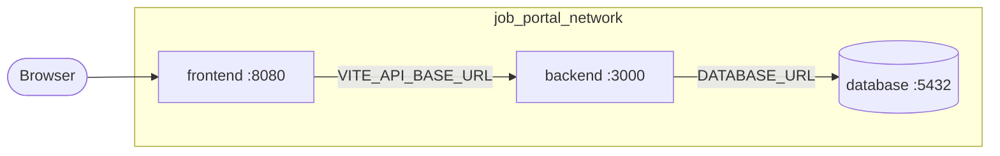

# Docker Compose orchestration

Multi-service stack for the Job Portal: **database** (PostgreSQL), **backend** (Express API), and **frontend** (React/nginx). One command starts the full application with health checks, persistent storage, and an isolated bridge network.

## Prerequisites

- Docker Engine 24+ (or compatible Podman with `docker compose`)
- ~2 GB free disk for images and the database volume

## Quick start (local)

```bash
cp .env.docker.example .env
docker compose up --build
```

| Service  | Compose name | URL / access |
| -------- | ------------ | ------------ |
| Frontend | `frontend`   | http://localhost:3000 |
| Backend  | `backend`    | http://localhost:8080/health |
| Database | `database`   | `localhost:5433` (user/db: `jobportal` by default) |

Stop containers and remove the database volume:

```bash
docker compose down -v
```

## Architecture



All services attach to the **`job_portal_network`** bridge network. The backend resolves the database hostname `database` (compose service name). Host port mappings are configurable via `.env`.

## Build contexts and Dockerfiles

| Service  | Build context | Dockerfile |
| -------- | ------------- | ---------- |
| `database` | Repository root (`.`) | `job-portal-database/Dockerfile` |
| `backend`  | Repository root (`.`) | `job-portal-backend/Dockerfile` |
| `frontend` | `./job-portal-frontend` | `Dockerfile` |

The database image copies SQL migrations from `db/migrations/` on first startup (empty volume). The backend image bundles Prisma client generation from the root `prisma/` directory.

## Environment variables

Copy [`.env.docker.example`](../.env.docker.example) to `.env` at the repository root. Compose substitutes `${VAR}` and `${VAR:-default}` in `docker-compose.yml`.

| Variable | Default | Purpose |
| -------- | ------- | ------- |
| `POSTGRES_USER` / `POSTGRES_PASSWORD` / `POSTGRES_DB` | `jobportal` | Database credentials |
| `DATABASE_HOST_PORT` | `5433` | Host port mapped to Postgres |
| `DATABASE_URL` | `postgresql://…@database:5432/…` | Backend → database connection |
| `BACKEND_HOST_PORT` | `8080` | Published API port |
| `CORS_ORIGIN` | `http://localhost:3000` | Allowed browser origin for API |
| `VITE_API_BASE_URL` | `http://localhost:8080` | API URL baked into frontend build |
| `FRONTEND_HOST_PORT` | `3000` | Published SPA port |
| `IMAGE_TAG` | `latest` | Tag for all service images |

Runtime-only frontend variables (`VITE_*` in the running container) are applied via `docker-entrypoint.sh` for `/env-config.js`; the build arg must still match for production builds.

## Cloud / staging deployment

Use the cloud override to avoid publishing the database port on the host:

```bash
export VITE_API_BASE_URL=https://api.your-domain.com
export CORS_ORIGIN=https://app.your-domain.com
docker compose -f docker-compose.yml -f docker-compose.cloud.yml up --build -d
```

In CI/CD, set secrets (`POSTGRES_PASSWORD`, etc.) in the pipeline environment or a managed secret store, then pass them as env vars before `docker compose up`. Push built images to a registry and set `image:` tags instead of `build:` when deploying to Kubernetes or managed containers.

## Health checks and startup order

1. **database** — `pg_isready` until healthy  
2. **backend** — waits for database, then `GET /health` (includes DB ping via Prisma)  
3. **frontend** — waits for backend, then `GET /health` on nginx  

## Verify inter-service communication

After the stack is up:

```bash
./scripts/compose-smoke-test.sh
```

Manual checks:

```bash
curl -sf http://localhost:8080/health | jq .
curl -sf http://localhost:8080/api/jobs | jq .
curl -sf http://localhost:3000/health
```

## Customization

- **Different host ports** — edit `DATABASE_HOST_PORT`, `BACKEND_HOST_PORT`, or `FRONTEND_HOST_PORT` in `.env`.
- **Rebuild one service** — `docker compose up --build backend`.
- **Logs** — `docker compose logs -f backend`.
- **Shell into database** — `docker compose exec database psql -U jobportal -d jobportal`.

## Troubleshooting

| Symptom | Likely cause | Fix |
| ------- | ------------- | --- |
| Backend stays unhealthy | Database not ready or wrong `DATABASE_URL` | `docker compose logs database`; confirm hostname is `database`, not `localhost`, inside containers |
| Frontend shows API errors | `VITE_API_BASE_URL` points at wrong host | Rebuild frontend after changing `.env`: `docker compose up --build frontend` |
| `port is already allocated` | Host port in use | Change `*_HOST_PORT` in `.env` |
| Empty job list | Schema initialized but no seed data | Run host seed: `cp .env.example .env && npm install && npm run db:seed` (see [database-seeding.md](./database-seeding.md)) |
| Stale schema after migration changes | Existing volume from old init SQL | `docker compose down -v` then `up --build` (destroys local DB data) |

## Related documentation

- [DOCKER.md](./DOCKER.md) — per-image build and security notes  
- [database-migrations.md](./database-migrations.md) — Prisma migrations  
- [database-seeding.md](./database-seeding.md) — sample data  
