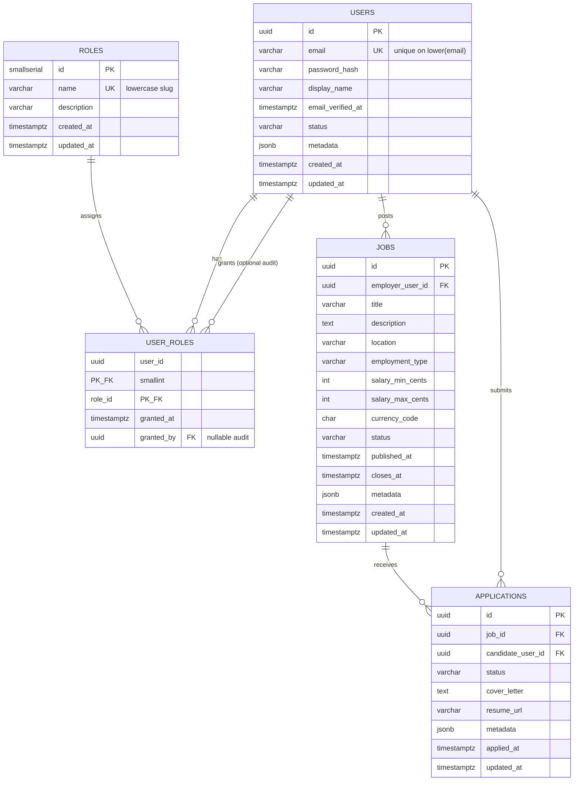

# Job Portal Core Schema (ERD)

This diagram is Mermaid-based so it renders on GitHub/GitLab and can be exported from many Markdown tools to PNG or PDF.

## Cardinality and integrity (summary)

- **Users to roles**: many-to-many via `user_roles`; composite primary key prevents duplicate grants.
- **Users to jobs**: one employer user to many jobs; `jobs.employer_user_id` references `users` with `ON DELETE RESTRICT` so postings are not silently orphaned.
- **Jobs to applications**: one job to many applications; `applications.job_id` uses `ON DELETE CASCADE` so applications disappear with the job (adjust if your product needs retention/history tables later).
- **Users to applications**: one candidate user to many applications; `applications.candidate_user_id` uses `ON DELETE CASCADE`.
- **Uniqueness**: one application per candidate per job via `ux_applications_job_candidate` on `(job_id, candidate_user_id)`.

## ORM mapping notes

- UUID primary keys and explicit `created_at` / `updated_at` align with Sequelize, TypeORM, and Prisma defaults.
- `metadata` JSONB columns provide forward-compatible extension without schema churn.
- Check constraints encode enumerated lifecycles at the database layer; ORMs can mirror these as enums in application code.
